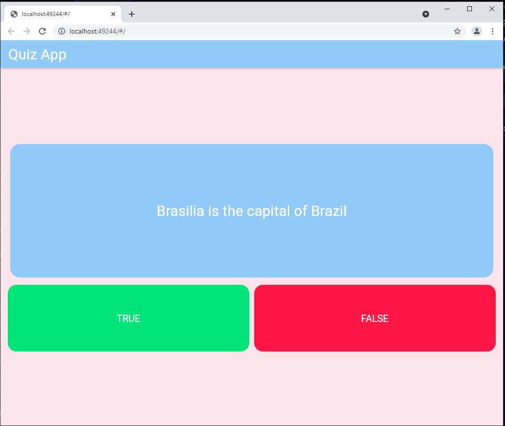

# exercicios

A beginner flutter project


## Getting Started

### Pré-requisitos

Antes de começar, você vai precisar ter instalado em sua máquina as seguintes ferramentas:

- [Git](https://git-scm.com/)
- [Visual Studio Code](https://code.visualstudio.com/)
- [Dart](https://dart.dev)
- [Flutter](https://flutter.dev)


### Clonando repositório

Para clonar o repositório em algum lugar na sua máquina, basta utilizar o comando abaixo:
```bash
$ git clone https://github.com/augustinho2/c214-extras.git
```
### Iniciando a aplicação
Para ver a aplicação funcionando, abra o terminal do VsCode e digite o comando
```sh
flutter run
```

## App running example
<br>

<br>


### Dependências de desenvolvimento
- [Dart](https://dart.dev/tools/vs-code)
- [Flutter](https://flutter.dev/docs/development/tools/vs-code)


